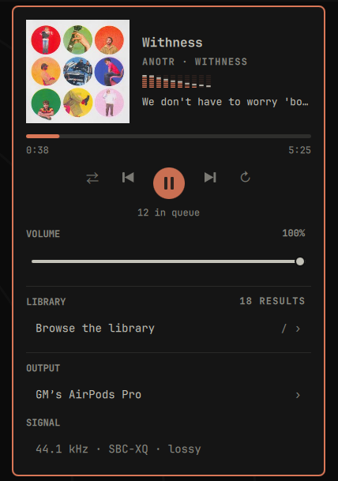

# Cliamp

[cliamp](https://www.cliamp.stream/) in the Omarchy bar: what is playing, where it is
routed, and whether the audio reaching your DAC is bit-perfect.



The last one is the reason this exists. Nothing else on the machine can tell you that
a 44.1 kHz track is being quietly resampled to 48 kHz before it reaches the speakers,
which is what PipeWire does by default to everything.

## Features

- **Now playing** with album art, artist and album, straight from cliamp's MPRIS
  interface, so it costs nothing while the panel is shut.
- **A live level meter** driven by PipeWire's own peak data, not by a second process.
- **Transport**: play, pause, next, previous, shuffle and repeat, plus a scrubber that
  hides itself for radio rather than pretending a stream can be seeked.
- **Output routing** per application. Switching here moves cliamp's own stream and
  leaves the system default alone, so your notifications keep going where they were.
- **A signal verdict** that only says "bit-perfect" when it really is, and otherwise
  names the specific thing in the way.
- **Rate following**, on by default: the audio graph is retuned to the track's sample
  rate while cliamp plays, and released the moment it stops.
- **The line being sung**, one line under the analyzer, resolved by cliamp and read off
  the same socket. It is offset by the real output latency, so it lines up with what
  you hear rather than with what has been decoded.

## The signal line

Three conditions must all hold before the words "bit-perfect" appear:

1. The server sent the original file. cliamp requests `format=raw` from Navidrome and
   gets untranscoded FLAC, so this normally holds for a self-hosted library.
2. The sink rate equals the stream rate, read back from the sink after any change,
   never assumed from the rate that was requested.
3. Gain is unity. cliamp must be at 0 dB, because any attenuation alters samples.
4. The EQ is flat. All ten bands must be zero, since any lift or cut is DSP. cliamp
   labels an untouched EQ "Custom", so the panel reads the band values and ignores the
   preset name. Set it with `cliamp eq Flat`.

| What you see | What it means |
| --- | --- |
| `FLAC 44.1 kHz · bit-perfect` | samples reach the DAC untouched |
| `44.1 → 48 kHz · resampled` | the graph is at a different rate |
| `88.2 → 96 kHz · output has no 88.2` | the rate was requested and the hardware substituted another |
| `44.1 kHz · SBC-XQ · lossy` | a Bluetooth sink, which re-encodes and can never be bit-perfect |
| `FLAC 44.1 kHz · EQ applied` | a band is lifted or cut, so the samples are processed |
| `FLAC 44.1 kHz · volume applied` | rates line up but a gain is being applied |
| `MP3 · transcoded by server` | the file was re-encoded before it ever arrived |

That third row matters more than it looks. Asking PipeWire for a rate the DAC does not
have lands on the nearest one it does, silently. The verdict is therefore always read
back from the sink, so the panel cannot claim a route it did not get.

## Keyboard

| Key | Action |
| --- | --- |
| `space` / `enter` | play or pause, or pick a device when the output list is open |
| `n` / `b` | next and back |
| `j` / `k` / `up` / `down` | move the cursor when a list is open |
| `h` / `l` / `left` / `right` | seek 5 seconds. Inert on a stream, where a seek would stop playback |
| `o` | open and close the output list |
| `s` | shuffle |
| `r` | repeat |
| `p` | toggle rate following |
| `/` | open the library, which puts the keyboard in the search field |
| `f` | start cliamp in a terminal, only when nothing is running |
| `esc` | close |

Opening the library hands the keyboard to its search field, and while that field has
focus the panel stops watching keys at all: every key in the table above goes to the
field instead, so typing a name with a space or an `s` in it searches rather than
pausing and shuffling. The field answers four keys itself: `up` and `down` move the
cursor, enter plays the highlighted row, and `esc` hands the keyboard back to the
panel, where a second `esc` closes it.

Left click opens the panel, right click plays or pauses without opening it.

## Requirements

- `cliamp` on `PATH`
- PipeWire, with `pw-metadata` and `pactl` available, both of which ship with it
- `omarchy-audio-sink-availability`, part of Omarchy, used to hide outputs with
  nothing plugged into them
- `foot`, used only to start cliamp when nothing is running

## Settings

| Setting | Default | Notes |
| --- | --- | --- |
| Seconds between status refreshes | 2 | only polls while the panel is open |
| Match the audio graph rate to the track | on | see the warning below |
| Relaunch cliamp at the track's native rate | off | see the warning below |
| Lyric timing trim in milliseconds | 0 | added on top of the measured output latency |
| Hide the icon when cliamp is not running | on | |
| Path to cliamp | empty | empty means find it on `PATH` |

## Notes worth reading once

**It runs headless.** `cliamp-daemon.service` keeps a daemon alive across logins, so
closing a terminal never stops the music. Pick a saved playlist from the panel's
Library section and it plays with nothing else open.

**The library is browsed in the panel, not in a terminal.** cliamp publishes the
current stream URL in its status, and that URL carries a salted Subsonic token, so
the panel reaches `getAlbumList2`, `getAlbum`, `getSong` and `search3` with it. Your
password is never handled here and never asked for. The token itself is a credential,
and it is the one cliamp already publishes and already writes into the playlist files
it saves, so nothing new is exposed and nothing is cached by this plugin.

Choosing an album or a song overwrites a single scratch playlist named `cliampui` and
loads it, which replaces the queue in place, so the daemon never stops and the music
never pauses to let you pick something. Reusing one file means browsing does not leave
a playlist behind every time you press something, at the cost of one reserved name: a
saved playlist called `cliampui` would be overwritten, so that name is hidden from the
browse list. Choosing a saved playlist row loads that playlist directly and writes
nothing.

**Browsing works before anything is playing.** The token is borrowed from whatever
cliamp is streaming, so a daemon that just started has none to lend. The playlists on
disk carry the same token in their stream URLs, and those are read instead, which means
the library is browsable from a cold start without anything being stored anywhere.

**One field searches songs, albums and saved playlists.** Rows are tagged with what
they are. Artists are not a row of their own, because an artist name already brings
up their albums and there would be nothing to play on an artist by itself. Choosing a
song plays that one song: cliamp has no jump-to-track command, so starting its album
from the right place is not something this can offer.

**cliamp is only launched when nothing is running.** It allows one instance per user,
so starting it while the daemon holds the socket would create a second, IPC-less copy
this panel cannot see. The Start row therefore appears only when the socket is free.

**Lyrics are cliamp's, not this plugin's.** cliamp resolves them from embedded tags,
then LRCLIB, then NetEase, and answers `{"cmd":"lyrics"}` on its socket with a list of
timestamped lines. The panel only draws them, so nothing here reaches the network and
a track with no lyrics shows no line at all.

**Lyrics are shifted to match the sound, not the decoder.** cliamp reports the position
it has decoded to, and PipeWire reports how far behind that the sink is: about 167 ms
over A2DP on this machine, against roughly nothing on the built-in output. That much is
subtracted automatically and re-read whenever the output changes. A headset also buffers
on the far side of the radio, where no host can measure it, so if the words still run
ahead of what you hear, add the difference with the lyric timing trim in settings.

**Navidrome tracks cannot be scrubbed.** They arrive as HTTP streams, and cliamp 1.63.2
cannot reposition one: a seek stops playback outright, measured on a 544 second track
that answered ok and then reported itself stopped. The progress bar is drawn but is
deliberately not interactive for streams. Local files scrub normally.

**The volume slider moves cliamp's PipeWire stream, not cliamp's own gain.** It is the
same thing the stock audio panel moves for `PipeWire ALSA [cliamp]`, so it changes only
this application and leaves the system volume alone. cliamp itself stays at 0 dB. Any
attenuation alters samples wherever it is applied, so anything under 100 percent costs
the bit-perfect verdict and the signal line says `volume applied`. Right click the
slider to return to unity.

**Rate following affects every application, not just cliamp.** The sample rate belongs
to the whole audio graph. While your music plays at 44.1 kHz, a browser playing 48 kHz
audio is the thing being resampled instead. It is released as soon as playback stops,
so the effect lasts exactly as long as the music. Turn it off in settings if that trade
is wrong for you.

**Native rate following is off by default.** cliamp fixes its output rate when it
starts and has no command to change it, so playing a 96 kHz file natively means
restarting the daemon. That gaps the audio, and because cliamp has no jump-to-track
command and cannot seek a stream, a Navidrome queue comes back at its first track.
Turn it on if you play local hi-res files and want the last resampler out of the path.

**Bluetooth can never be bit-perfect, and that is not a Linux limitation.** A2DP
carries SBC, AAC and similar, all lossy. AirPods offer only SBC, SBC-XQ and AAC, so
there is no lossless path to them from any operating system. Apple does not send
lossless over Bluetooth either; only AirPods Max on a wired USB-C connection carries
it. The panel names the codec in use so you can pick the least-bad one with the
Bluetooth settings, but none of them will earn a bit-perfect verdict.

**Enable this or the stock Media widget, not both.** They will both show the same track.

**A hard shell crash can leave the graph rate forced.** The panel releases it on a
clean shutdown, and the setting is session scoped, so restarting PipeWire clears it:

```bash
systemctl --user restart pipewire
```

## Install

```bash
git clone https://github.com/thisisgm/omarchy-cliampui ~/.config/omarchy/plugins/io.github.thisisgm.cliampui
omarchy plugin enable io.github.thisisgm.cliampui
omarchy bar put io.github.thisisgm.cliampui --section right
```

Then, once, point cliamp at your library and start the daemon:

```bash
cliamp setup
install -Dm644 ~/.config/omarchy/plugins/io.github.thisisgm.cliampui/cliamp-daemon.service ~/.local/share/systemd/user/cliamp-daemon.service
systemctl --user daemon-reload
systemctl --user enable --now cliamp-daemon.service
```

`cliamp setup` is what writes your Navidrome server into `~/.config/cliamp/config.toml`.
Without it the provider does not appear in cliamp at all, and the daemon has nothing to
play.

## Removal

```bash
systemctl --user disable --now cliamp-daemon.service
rm -f ~/.local/share/systemd/user/cliamp-daemon.service
omarchy plugin disable io.github.thisisgm.cliampui
rm -rf ~/.config/omarchy/plugins/io.github.thisisgm.cliampui
```

## Development

`Model.js` is pure JavaScript with no QML imports, so it is covered by tests:

```bash
deno run --allow-read tests/model.test.js
```

The fixtures are lines a running cliamp actually printed, including the 88.2 kHz
substitution this machine performs.

## License

MIT
